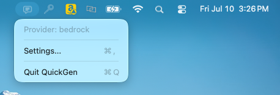
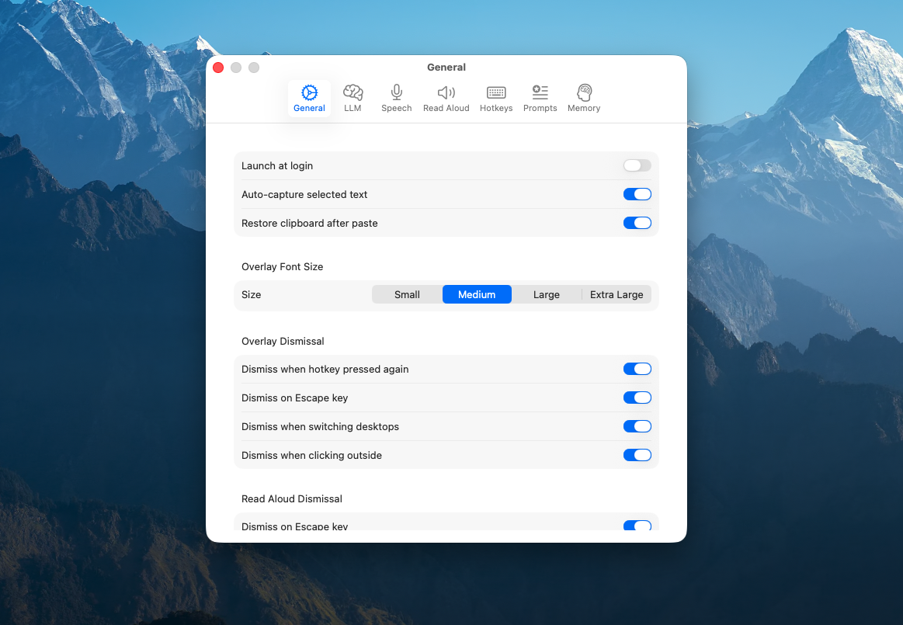
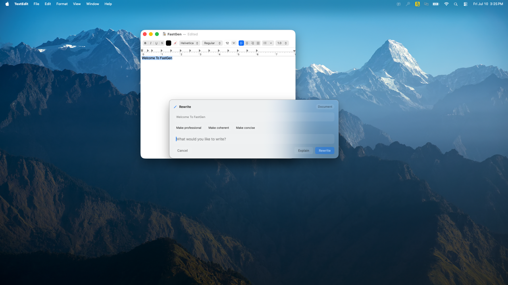
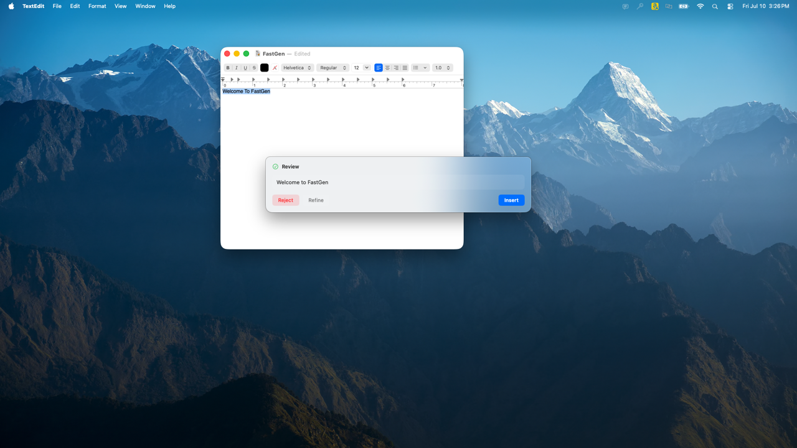
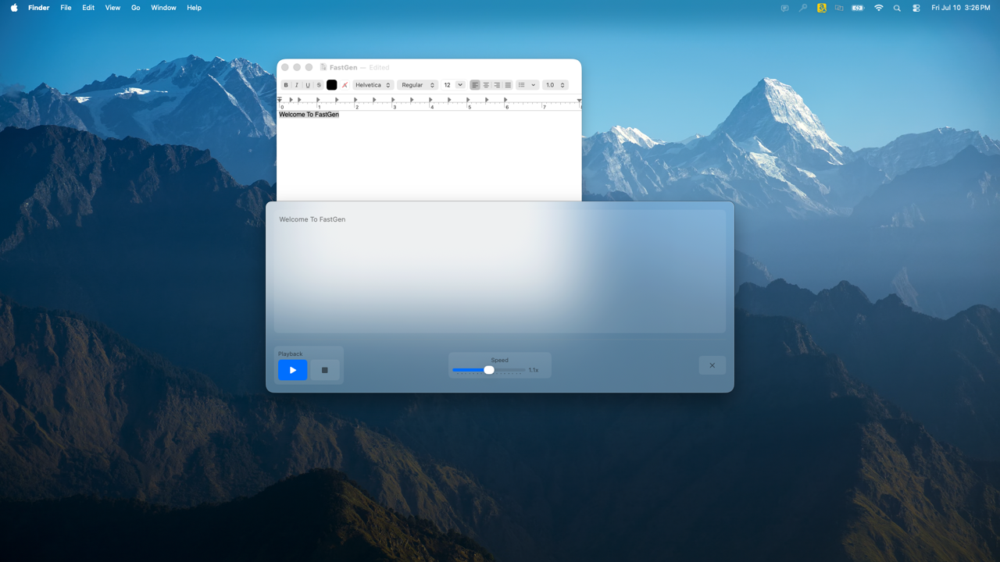

# cross-app-local-ai

A native macOS menu bar application that brings AI-powered text generation, speech-to-text (STT), and text-to-speech (TTS) to any application on your Mac. Using global hotkeys and a floating overlay, it captures text from whichever app you're working in, refines or explains it via an LLM, and inserts the result back — all without leaving your current context.

All three core models (LLM, STT, TTS) can run entirely on-device for maximum privacy, or connect to Amazon Bedrock for cloud-powered inference when you need it.

> The Xcode project, scheme, and bundle identifier are named `FastLang` for historical reasons. `FastLang` and `cross-app-local-ai` refer to the same application throughout this repository and its documentation.

## Why

Knowledge workers context-switch constantly — drafting an email, editing a chat message, writing code comments — and each time AI assistance is needed, that usually means copying text out, switching to a separate chat window, pasting, waiting, copying the result back, and switching again. `cross-app-local-ai` removes that friction: press a hotkey, get a floating overlay above your current app, and accept the result with a single click or Escape to dismiss.

The key differentiator is that **all three AI capabilities can run entirely on-device**. No data leaves your Mac unless you explicitly choose a cloud provider. For teams that need cloud-scale models, Amazon Bedrock integration is built in.

## Features

- **Text Refinement (LLM)** — select text in any app, press a hotkey, and get a context-aware rewrite. Per-application system prompt templates (Slack, Outlook, Gmail, VS Code, Word, and more), streaming generation, iterative refinement, an explain mode, quick-prompt shortcuts, and per-app adaptive learning of your writing preferences.
- **Voice Input (STT)** — push-to-talk dictation powered by [WhisperKit](https://github.com/argmaxinc/WhisperKit), running on the Apple Neural Engine. Multiple model tiers (75 MB to 3.1 GB), 39 supported languages, configurable input device.
- **Read Aloud (TTS)** — on-device neural text-to-speech (Kokoro-82M via CoreML) with word-level highlighting synchronized to playback, adjustable speed, and an optional LLM-powered summarize action for long selections. Falls back to the system `AVSpeechSynthesizer` when the neural model isn't available yet.
- **Flexible model execution** — the same interface works whether inference happens locally via [llama.cpp](https://github.com/ggerganov/llama.cpp) with Metal acceleration, or in the cloud via Amazon Bedrock (Claude, Amazon Nova), using your existing AWS credential chain.
- **Model integrity verification** — all model downloads are verified with streaming SHA-256 hashing and automatically re-downloaded on mismatch.
- **Privacy-respecting telemetry** — anonymous, opt-out, daily-aggregate-only usage counts. The telemetry system is a no-op in builds without configured credentials, which is the default for anyone building from this source.

## Screenshots

**Menu bar** — access every feature from a single menu bar icon.



**Settings** — configure LLM, STT, and TTS providers and models, hotkeys, and behavior.



**Text refinement** — select text and press the hotkey to open the overlay with your prompt, then accept the result to insert it back in place.




**Read aloud** — listen to selected text with word-level highlighting synced to playback.



## Architecture

```
                        macOS Menu Bar
                    [cross-app-local-ai icon]
         |                    |                    |
         v                    v                    v
  Text Refine          Push-to-Talk           Read Aloud
  (hotkey)             (hotkey)               (hotkey)
         |                    |                    |
         v                    v                    v
                    Floating Overlay Panel
         |                    |                    |
         v                    v                    v
   LLM Service           STT Service           TTS Service
   Local (llama.cpp)     WhisperKit            Kokoro (CoreML)
   Bedrock (cloud)                             System (AVSpeech)
```

Each capability (LLM, STT, TTS) is defined behind a Swift `protocol` with local and cloud implementations, so adding a new backend means conforming to that protocol rather than touching call sites. Text capture and injection use a two-tier strategy — the Accessibility API (`AXUIElement`) first, falling back to clipboard simulation (`CGEvent`) for apps that don't expose text selection — so the app works across virtually any macOS application without app-specific integrations.

The pipeline itself is orchestrated by an actor-based deterministic state machine (`idle → contextCapture → awaitingPrompt → generating → awaitingAction → injecting → idle`), which prevents double-generation, wrong-app injection, and UI desynchronization under full async concurrency.

See [SECURITY.md](SECURITY.md) for the sandboxing model, the XPC credential helper design, and other documented security considerations.

## Prerequisites

- macOS 15+
- Xcode 16+
- [XcodeGen](https://github.com/yonaskolb/XcodeGen) — `brew install xcodegen`
- Apple Development certificate (for Debug builds)

## Building from Source

```bash
git clone https://github.com/awslabs/cross-app-local-ai.git
cd cross-app-local-ai
make build          # Regenerates the Xcode project and builds Debug configuration
make open           # Or open in Xcode for development
```

### Project structure and dependencies

This project uses [XcodeGen](https://github.com/yonaskolb/XcodeGen). **`project.yml` is the single source of truth** for targets, build settings, and dependencies. `FastLang.xcodeproj` is *generated* from `project.yml` and is **not committed** (it is gitignored). Do not edit it in Xcode's UI and do not commit it — any change there is lost on the next generation.

If you know Node, the mental model maps directly:

| Node | This project |
|------|----------|
| `package.json` | `project.yml` |
| `node_modules/` (generated, gitignored) | `FastLang.xcodeproj/` (generated, gitignored) |
| `npm install` | `xcodegen generate` (`make generate`) |
| `package-lock.json` (committed) | `Package.resolved` (committed) |

Dependencies are declared in `project.yml` and resolved by Swift Package Manager, which records exact versions in `Package.resolved` (the lock file). `Package.resolved` lives inside `FastLang.xcodeproj/` but is the one file there that IS committed, via a `.gitignore` exception, for reproducible builds.

#### First checkout, or after editing `project.yml`

```bash
make generate     # regenerate FastLang.xcodeproj from project.yml
make open         # regenerate, then open in Xcode
```

Available targets (each regenerates the project first unless noted):

| Target | What it does |
|--------|-------------|
| `make generate` | Regenerate `FastLang.xcodeproj` from `project.yml` |
| `make build` | Debug build |
| `make test` | Run the full test suite |
| `make open` | Open the project in Xcode |
| `make release` | Build a Release `.app` (no signing, no installer) |
| `make pkg` | Build an unsigned `.pkg` installer |
| `make clean` | Remove `build/` artifacts (no regenerate) |

Quit Xcode before `make generate` (or just use `make open`), since generation rewrites the project on disk.

#### Adding a dependency

1. Declare the package under `packages:` in `project.yml`.
2. Attach its product to the target that uses it, under that target's `dependencies:`. Both steps are required — declaring the package alone does not link it, so `import` will fail.
3. Run `make generate`.
4. Build in Xcode; SPM fetches the package and updates `Package.resolved`.
5. Commit **both** `project.yml` and the updated `Package.resolved`.

```yaml
packages:
  swift-markdown:
    url: https://github.com/apple/swift-markdown
    from: "0.6.0"

targets:
  FastLang:
    dependencies:
      - package: swift-markdown
        product: Markdown      # the module you `import` (see the package's products)
```

### Build configurations

| Config | App Name | Bundle ID | Signing |
|--------|----------|-----------|---------|
| Debug | FastLang-Dev.app | com.aws.fastlang.dev | Apple Development certificate |
| Release | FastLang.app | com.aws.fastlang | Ad-hoc (`-`) |

```bash
# Regenerate the project first (required — the .xcodeproj is not committed)
make generate

xcodebuild -scheme FastLang -configuration Debug -arch arm64 build
xcodebuild -scheme FastLang -configuration Release -arch arm64 build
```

### Code signing and permissions

By default the Debug build is **ad-hoc signed**, which produces a new code directory hash on every build. macOS TCC (Transparency, Consent, and Control) ties permission grants (Accessibility, Microphone) to the signing identity, so with ad-hoc signing each rebuild looks like a new app and you have to re-grant permissions every time.

To make grants persist, sign your local Debug builds with your **own Apple Development certificate**. This is per-developer, optional, and affects local Debug builds only.

Signing is wired through two root xcconfig files:

- `Local.xcconfig` — tracked, committed. A no-op entry point that optionally includes your private overrides (`#include? "Local.private.xcconfig"`). It's committed so `project.yml`'s `configFiles` reference is always valid, including on CI.
- `Local.private.xcconfig` — **gitignored, per-developer**. Holds your signing identity. Absent by default; when missing, the include is a no-op and the build stays ad-hoc.

Setup:

1. Find your Apple Development certificate's SHA-1:
   ```bash
   security find-identity -v -p codesigning
   ```
   Copy the 40-character hex hash next to your `Apple Development: <you>` entry.

2. Create `Local.private.xcconfig` in the repo root:
   ```
   CODE_SIGN_STYLE = Manual
   CODE_SIGN_IDENTITY = <your-40-char-SHA-1>
   ```
   Use the SHA-1 hash, not the identity name: automatic signing via the `xcodebuild` CLI rejects the unified "Apple Development" cert, and manual signing by name plus `DEVELOPMENT_TEAM` triggers a team-membership check that fails for a personal certificate. The hash names the cert unambiguously and needs no team or provisioning profile for local dev.

3. Regenerate and build:
   ```bash
   make generate
   make build        # or build in Xcode (Cmd+B)
   ```
   Xcode runs `codesign` automatically at the end of the build using this identity. Confirm with:
   ```bash
   codesign -dvvv <path-to>/FastLang-Dev.app 2>&1 | grep -iE 'Authority|Signature'
   ```
   You should see your `Apple Development` authority and no `Signature=adhoc`.

4. Grant Accessibility (and Microphone if prompted) once in System Settings > Privacy & Security. Because the signing identity is now stable, the grant persists across all future rebuilds.

Never commit `Local.private.xcconfig` (it is gitignored).

### Running Amazon Bedrock (optional, cloud)

`cross-app-local-ai` runs entirely on-device by default. To use Amazon Bedrock instead:

1. Configure AWS credentials in `~/.aws/config`, using either standard access keys or a `credential_process` directive (any `credential_process`-compatible binary works — this is a standard AWS mechanism, not specific to this project):
   ```ini
   [profile my-profile]
   region = us-east-1
   credential_process = /path/to/credential-helper
   ```
2. Open Settings > LLM and select "Amazon Bedrock" as the provider.
3. Choose your AWS profile and preferred model.

Model access must be enabled for the chosen models in your AWS account. If credentials expire at runtime (e.g., an SSO session timeout), the LLM service reconstructs itself on the next generation attempt without requiring an app restart.

## Tests

```bash
make test    # regenerates the project, then runs the full suite

# or directly (regenerate first if project.yml changed):
xcodebuild test -scheme FastLang -destination 'platform=macOS'
xcodebuild test -scheme FastLang -destination 'platform=macOS' -only-testing:UnitTests
```

## Lint and Format

```bash
pre-commit run --all-files
swiftlint --strict
swiftformat .
```

## Security

See [SECURITY.md](SECURITY.md) for documented security considerations and accepted risks, including the XPC credential helper design, SPM supply chain posture, and Accessibility permission scope. If you discover a potential security issue, please follow the instructions there rather than opening a public issue.

## Contributing

See [CONTRIBUTING.md](CONTRIBUTING.md) for details on our code of conduct and the process for submitting pull requests.

## License

This project is licensed under the MIT License. See [LICENSE](LICENSE) for details.
